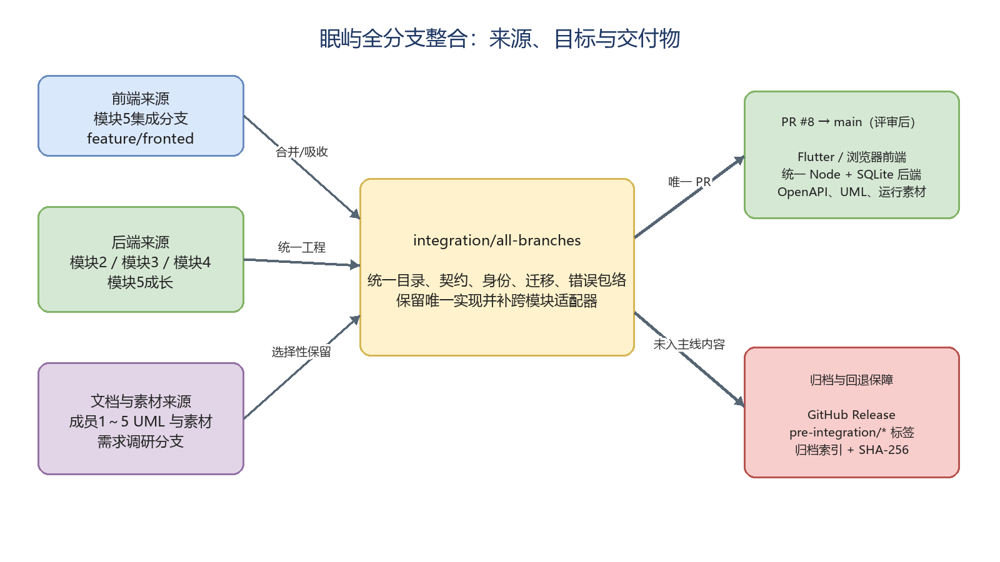
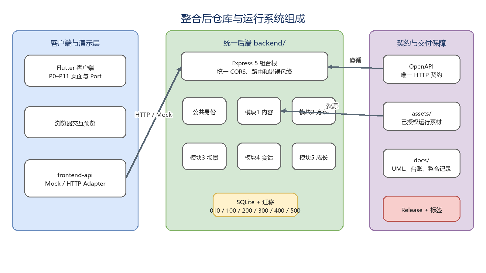
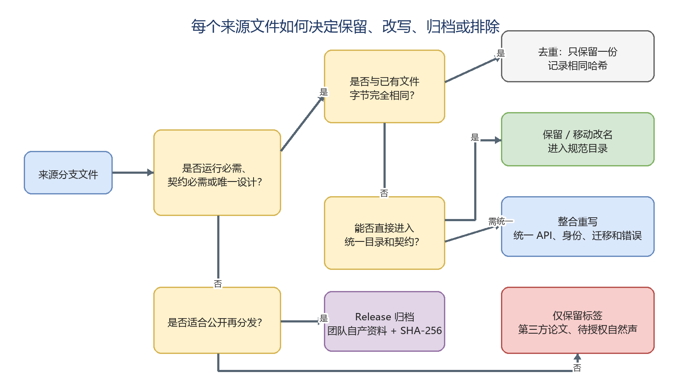

# 眠屿全分支整合完整报告

## 1. 报告摘要

本次工作以远程 `main` 的 `568af1c` 为基线，在独立分支 `integration/all-branches` 上整合 11 个非 `main` 分支，最终通过单一 PR [#8](https://github.com/Mianyu-Sleep-Isle/mianyu/pull/8) 提交评审。截至功能整合提交 `85a0ae4`，PR 包含 46 个提交、263 个变更文件、18,571 行新增和 7 行删除；GitHub 判定为 `MERGEABLE / CLEAN`。

整合不是把所有分支机械地串行合并，而是：

1. 以模块5集成分支作为前端基线；
2. 以成员2后端作为统一 Node 后端骨架；
3. 将成员3场景、成员4会话、成员5成长模块迁入同一个 `backend/`；
4. 以 `contracts/openapi.yaml` 为唯一 HTTP 契约；
5. 对图片、音频、UML、调研材料按“运行必需、唯一有效、许可允许”三个条件筛选；
6. 对不进入主线的内容通过 GitHub Release 或 `pre-integration/*` 标签保留。

**没有删除任何远程原分支，也没有直接修改 `main`。** 本报告中的“删除”或“排除”仅指文件没有进入最终集成树；原始内容仍可从预整合标签或 Release 恢复。

## 2. 整合范围与基线

### 2.1 分支范围

| 分支 | 整合前提交 | 相对 main 文件规模 | 备份标签 |
|---|---:|---:|---|
| `main` | `568af1c` | 基线 | `pre-integration/main` |
| `feature/module5-backend-integration` | `efd6763` | 134 个文件，108.0 MB | `pre-integration/feature-module5-backend-integration` |
| `feature/fronted` | `ea57e1f` | 116 个文件，107.9 MB | `pre-integration/feature-fronted` |
| `feature/mk-backend` | `fd99787` | 30 个文件，44.9 MB | `pre-integration/feature-mk-backend` |
| `myh-backend` | `de3c5ff` | 15 个文件，4.7 MB | `pre-integration/myh-backend` |
| `feature/m4-session` | `98c592a` | 21 个文件，0.1 MB | `pre-integration/feature-m4-session` |
| `feature/member2-design-diagrams` | `0b7184d` | 5 个文件，0.2 MB | `pre-integration/feature-member2-design-diagrams` |
| `成员四_UML类图时序图用例图` | `d0831d9` | 37 个文件，24.0 MB | `pre-integration/member4-uml-diagrams` |
| `feature/member3-m0-scene` | `43c6d02` | 14 个文件，36.0 MB | `pre-integration/feature-member3-m0-scene` |
| `feature/minin-minin`（首次快照） | `5a4e0c8` | 31 个文件，201.8 MB | `pre-integration/feature-minin-minin` |
| `feature/minin-minin`（整合期间最终快照） | `948d8ca` | 60 个文件，398.1 MB | `pre-integration/feature-minin-minin-v2` |
| `feature/requirement-research` | `c948cfc` | 36 个文件，22.1 MB | `pre-integration/feature-requirement-research` |
| `feature/需求分析` | `c152f96` | 4 个文件，1.2 MB | `pre-integration/feature-requirement-analysis` |

`feature/minin-minin` 在整合期间新增了成员1后端交付包，因此保存了两个时间点；最终处置以 `948d8ca` 为准。

### 2.2 整合原则

- **保留唯一实现**：同一能力有多份实现时，只保留能接入统一工程的一份。
- **按哈希去重**：文件内容完全相同但路径不同，不重复保存。
- **统一目录**：运行代码进入 `backend/`、`lib/`、`frontend-api/`；设计图进入 `docs/diagrams/`；运行音频进入 `assets/audio/`。
- **统一契约**：前后端接口以 `contracts/openapi.yaml` 为准，不保留互相冲突的独立接口。
- **许可优先**：没有来源或许可依据的自然声不进入会被 GitHub Pages 公开部署的主线。
- **可回退**：原分支不删除，并为每个分支建立注解标签。

## 3. 整体整合结果



可编辑图源：[全分支整合来源图.drawio](../diagrams/全分支整合来源图.drawio)。

### 3.1 最终仓库包含的主要内容

- Flutter 客户端：`lib/`、`test/`、`pubspec.yaml`；
- 浏览器交互预览：`system_preview.html`、`app_pages.js`、`app_pages.css`；
- 前端传输层：`frontend-api/`，包含 Mock 与 HTTP Adapter；
- 统一后端：`backend/`，包含公共身份、内容、方案、场景、会话、成长六个模块；
- 统一契约：`contracts/openapi.yaml`；
- 运行素材：`assets/images/`、`assets/audio/indoor/`、`assets/audio/stories/`、`assets/audio/breath/`；
- 正式场景图：`assets/scenes/`，目前尚未接入前端；
- 成员1～5 UML：`docs/diagrams/成员*/`；
- 素材许可和交付台账：`docs/素材台账/`；
- 分支整合与归档记录：`docs/integration/`、`docs/archive-index.md`。

### 3.2 最终系统组成



可编辑图源：[整合后系统组成.drawio](../diagrams/整合后系统组成.drawio)。

## 4. 文件处置规则



可编辑图源：[文件处置决策流程.drawio](../diagrams/文件处置决策流程.drawio)。

文件按以下六种结果处理：

| 结果 | 含义 | 典型示例 |
|---|---|---|
| 原路径保留 | 最终树中路径和内容均不变 | 大部分 Flutter 页面和图片 |
| 移动改名 | 内容哈希不变，仅进入规范目录 | 成员2室内声、成员2 UML |
| 整合重写 | 保留功能，但为了统一工程或契约修改代码 | `backend/src/app.ts`、OpenAPI、各模块路由 |
| 解压吸收 | 原来是 zip，最终保存其中唯一设计图 | 成员3、成员5 UML 图包 |
| Release 归档 | 不属于运行目录但允许团队公开归档 | 调研报告、访谈、早期 Fake/SQL |
| 标签保留 | 不适合公开再分发或尚未授权 | 第三方论文、成员1自然声候选 |

## 5. 各分支完整处置说明

### 5.1 `main`

**保留内容**

- 以 `main@568af1c` 作为全部整合的共同基线。
- 保留原 README 的项目介绍和协作指南主体，没有采用前端分支里的缩短版 README。

**修改内容**

- README 增加当前代码结构、统一后端启动方式、素材目录、整合记录和已知缺失文档说明。

**删除内容**

- 没有从远程 `main` 删除分支或历史。

### 5.2 `feature/module5-backend-integration`

该分支被选作前端基线。相对来源树核对结果为：115 个文件原样保留、7 个文件整合重写、12 个旧路径不再保留。

**原样合入**

- Flutter 的 P0～P11 页面、主题、状态控制器、DTO 和 Port；
- 浏览器预览及原型图片；
- `assets/images/**` 共 42 个前端视觉资源；
- `frontend-api/` 的大部分契约与适配器代码；
- GitHub Pages 工作流。

**整合后修改**

- `README.md`：恢复 `main` 的完整介绍，再补当前工程说明；
- `contracts/openapi.yaml`：升级为统一五模块契约；
- `docs/FRONTEND_BACKEND_INTEGRATION.md`：改写为当前 Mock/HTTP 切换现状；
- `frontend-api/http-adapters.js`：会话启动改成“准备 + 真正开始”两步调用；
- `frontend-api/tests/adapters.test.cjs`：补接口路径、默认端口和调用顺序测试；
- 根 `package.json`：保留前端测试，并增加统一后端检查入口；
- `pubspec.yaml`：补内容图片、室内声、故事和呼吸音频目录。

**未保留的旧路径**

以下 `backend/module5/` 独立小工程没有原样进入最终树：

- `.gitignore`、`package.json`、`package-lock.json`、`tsconfig.json`；
- `src/app.ts`、`server.ts`、`database.ts`；
- `src/contracts.ts`、`service.ts`、`session-facts.ts`；
- `test/growth.test.ts`；
- 原模块 README。

这些不是功能被删除，而是被迁移到：

- `backend/src/modules/growth/`；
- `backend/src/modules/growth/testing/session-facts.ts`；
- `backend/migrations/500_module5_growth.sql`；
- 统一 `backend/package.json`、`backend/src/app.ts` 和共享数据库连接。

### 5.3 `feature/fronted`

该分支与 `main` 没有共同祖先，但前端主体已经包含在模块5集成分支。实际整合时保留其独有的 `docs/团队开发/` 六份文档。核对结果为：109 个文件内容相同、7 个文件后来重写、没有独有文件被无备份删除。

**保留内容**

- `docs/团队开发/` 下六份后端团队开发文档；
- 与模块5前端基线相同的页面、图片和预览文件只保留一份。

**整合后修改**

- `README.md`、`pubspec.yaml`：按最终仓库状态更新；
- `app_pages.css`、`app_pages.js`、`system_preview.html`、`verify_frontend.ps1`：采用模块5基线中的较新版本；
- `docs/团队开发/眠屿项目后端开发与团队协作指南.md`：增加“整合后以 OpenAPI 和后端 README 为准”的提示。

**删除内容**

- 没有删除该分支的独有有效内容；
- 重复前端文件没有重复写入第二份。

### 5.4 `feature/mk-backend`

该分支提供统一后端骨架、模块2方案决策和成员2室内声。核对结果为：13 个文件原样保留、6 个音频移动改名、10 个文件整合重写、1 份台账移动并更新。

**原样合入**

- `backend/migrations/200_module2_planning.sql`；
- 模块2类型、规则引擎、意图解析、解释器、schema、seed 和测试；
- 后端 TypeScript 配置与锁文件等可复用部分。

**移动改名**

六个室内声从 `sucai/level1/成员2-室内声/` 移到：

- `assets/audio/indoor/A03_fireplace.mp3`
- `assets/audio/indoor/A04_page_turn.mp3`
- `assets/audio/indoor/A07_room_tone_night.mp3`
- `assets/audio/indoor/A08_wood_fire.mp3`
- `assets/audio/indoor/A10_keyboard.mp3`
- `assets/audio/indoor/A11_blanket_rub.mp3`

素材台账从 `睡前沟通与方案决策/素材台账.md` 改为 `docs/素材台账/成员2-室内声.md`，并把交付目录更新成新路径。

**整合后修改**

- `backend/src/app.ts`：从模块2单模块入口扩展为六模块组合根；
- `backend/src/server.ts`：统一端口和数据库路径；
- `backend/package.json`、`.env.example`、README；
- 模块2的 routes、service、repository、frontend-compat 和 README；
- 情绪、时长、前端 snake_case 兼容以及素材名称解析。

**不再保留的旧结构**

- `sucai/` 和根目录 `睡前沟通与方案决策/` 空目录不再保留；
- 内容已移动，没有丢失。

### 5.5 `myh-backend`

该分支提供模块3场景编辑真实后端。核对结果为：11 个文件原样保留、4 个文件整合重写、没有文件被排除。

**原样合入**

- `300_module3_scene.sql`；
- 场景类型、schema、validator、mapper、fakes 和测试；
- 两张正式场景图与 `assets/scenes/README.md`。

**整合后修改**

- `repository.ts`：增加按快照和用户查询当前场景；
- `service.ts`：增加当前场景与快照读取；
- `routes.ts`：增加 `/scenes/current`、规范 `/handoff` 路由和前端 DTO 装饰；
- README：更新为统一后端运行方式。

**新增的跨模块行为**

- 场景素材通过内容模块端口校验；
- 使用非 UUID 的演示 `plan_id/scene_id` 时回退到用户当前方案和场景；
- 已交接场景再次编辑时先复制，避免修改已进入会话的快照。

### 5.6 `feature/m4-session`

该分支提供模块4睡眠会话领域逻辑。核对结果为：14 个文件原样保留、5 个文件整合重写、2 个根配置文件排除。

**原样合入**

- `400_module4_sleep.sql`；
- 会话状态机、服务、仓储、类型；
- 测试 harness、fakes 和大部分单元测试。

**整合后修改**

- `session/routes.ts`：增加正式 HTTP 路由、统一错误翻译、身份读取和 DTO；
- 三个测试文件增加严格 TypeScript 空值保护；
- 会话 README 更新；
- 根 `package.json` 的有效脚本和依赖合并到 `backend/package.json`。

**排除内容**

- 分支根目录 `package-lock.json`；
- 分支根目录 `tsconfig.json`。

排除原因是它们会与前端根配置和统一后端配置发生 add/add 冲突。会话模块最终使用 `backend/package-lock.json` 和 `backend/tsconfig.json`，功能未删除。

**重要行为调整**

- `POST /sessions` 只负责准备；
- `POST /sessions/{id}/start` 在音频真正开始时调用；
- 准备阶段退出记为 `user_cancelled_before_start`，不计分且不能提交反馈；
- 运行后停止记为 `user_ended`，允许晨间反馈；
- 计时完成后把方案标记为 `completed`。

### 5.7 `feature/member2-design-diagrams`

该分支 5 张 UML 全部保留，文件内容不变，仅移动到统一目录：

- 三张时序图；
- 一张用例图；
- 一张类图；
- 目标目录：`docs/diagrams/成员2-睡前沟通与方案决策/`。

没有文件被删除。

### 5.8 `成员四_UML类图时序图用例图`

该分支 37 个文件都能在最终树找到相同内容，但只保留唯一副本。

**保留的 8 张独有 UML**

- `时序图-10`、`时序图-11`、`时序图-12`；
- `用例图-04A`、`04B`、`04C`、`04D`；
- `类图-04_睡眠模式与夜间记录.png`；
- 统一放到 `docs/diagrams/成员4-睡眠模式与夜间记录/`。

**去重的 29 个文件**

- 2 个 App 图标；
- 12 个 SVG 声音图标；
- 12 个声音实体 PNG；
- 3 张背景图。

这些文件与前端基线 `assets/images/{brand,icons,sounds,scenes}/` 中的文件内容哈希完全一致，因此没有再保留 `APP图标/`、`图标/`、`图标效果实体/`、`背景/` 四套旧路径。它们不是素材丢失，而是去掉重复副本。

### 5.9 `feature/member3-m0-scene`

该分支有 14 个文件：6 个运行 MP3 保留，1 份音频说明移动并更新，7 个早期场景原型归档。

**进入运行目录**

- 5 个故事音频 → `assets/audio/stories/`；
- 1 个呼吸音频 → `assets/audio/breath/`；
- 音频清单 → `docs/素材台账/成员3-故事呼吸.md`；
- 后端内容清单将 ST01～ST05、BR01 指向这些音频，并按实际时长更新。

**不进入 main、改为 Release 归档**

- `成员3-梦境空间与声景创作/README.md`；
- `assets/V01-V02台账.md`；
- `fake/fake_scene_config_query.dart`；
- `fake/fixtures.json`；
- `fake/scene_config_query_port.dart`；
- `sql/001_module3_scene.sql`；
- `场景图/README.md`。

归档附件为 `mianyu-member3-scene-prototype.zip`。排除原因是 Fake 查询和旧 SQL 已被 `myh-backend` 的真实场景模块与 `300_module3_scene.sql` 替代。

### 5.10 `feature/minin-minin`

该分支在整合期间从 31 个文件更新到 60 个文件，最终按 `948d8ca` 处置。

**进入 main 的 16 个文件**

- 内容中心 5 张 UML PNG 和 1 份设计说明，进入 `docs/diagrams/成员1-眠境探索与内容中心/`；
- 成员1后端交付包的 4 份 config、1 个检查脚本、2 份说明、CSV/Markdown 清单和检查结果，共 10 个文件，进入 `docs/素材台账/成员1-自然声/`。

**不进入 main 的 38 个音频路径**

- 原目录 `sucai level1 成员1-自然声/` 有 19 个 MP3；
- 新交付包 `成员一后端文件交付包/assets/audio/` 又有 19 个重命名副本；
- 两组音频逐文件字节相同，因此实际是 19 个唯一音频，不是 38 个不同素材。

成员1交付说明明确写明：

- 没有版权凭证；
- 没有逐条人工听审；
- 审核前 `enabled=false`、`allowRecommendation=false`；
- A12 远雷只用于“不要打雷”排除测试。

因此这些音频不进入会被 GitHub Pages 公开部署的 `main`，也不在公开 Release 二次分发，只保留在 `pre-integration/feature-minin-minin-v2`。统一内容清单中的 A01、A02、A05、A06、A09 为 `pending_review`、不可播放；A12 额外设为 `exclusionTestOnly`，即使显式选择也会拒绝。

**归档到 Release 的 6 个访谈文件**

- 大学生访谈记录；
- 访谈分析；
- 儿童家长、大学生、职场上班族访谈提纲；
- 综合访谈记录。

附件为 `mianyu-user-interviews.zip`。

### 5.11 `feature/requirement-research`

该分支 36 个文件全部从运行树排除，但按版权和用途分三类保存。

**Release 归档：16 个文件**

- 团队整理的需求总结；
- 小红书、知乎体验分析；
- 四款应用商店评论表；
- 竞品和交叉验证报告；
- 功能需求清单、使用场景卡片、功能优先级矩阵；
- 分支内说明文件。

附件为 `mianyu-requirement-research.zip`。

**只保留在标签：19 个第三方 PDF**

第三方统计报告和论文不进入公开 Release，避免未经确认的二次分发。完整文件名和 SHA-256 见 `docs/archive-index.md`。

**解压进入 main：1 个图包**

`docs/diagrams/成员3需求分析图片.zip` 没有原样保存，内部 8 张 UML 被解压到 `docs/diagrams/成员3-梦境空间与声景创作/`。

### 5.12 `feature/需求分析`

该分支 4 个文件按以下方式处置：

**Release 归档：3 个文件**

- 助眠应用用户需求调研报告简洁版；
- 助眠应用用户需求调研问卷详细数据及总结；
- 眠屿助眠应用用户需求调研问卷。

附件为 `mianyu-requirement-analysis.zip`。

**解压进入 main：1 个图包**

`模块5各类图.zip` 没有原样保存，内部 5 张 UML 被解压到 `docs/diagrams/成员5-晨间反馈与成长/`。

## 6. 统一后端具体改造

### 6.1 目录和运行时

- Node.js 版本要求：`>=24.11 <25`；
- Express 5；
- Zod 4；
- Node 内置 `node:sqlite`；
- TypeScript 直接通过 `--experimental-transform-types` 运行；
- 默认端口 `8787`；
- 默认数据库 `backend/data/mianyu.sqlite`。

### 6.2 数据库迁移

统一迁移按编号执行：

| 版本 | 模块 | 文件 |
|---:|---|---|
| 010 | 公共用户 | `010_common_user.sql` |
| 100 | 内容收藏 | `100_module1_content.sql` |
| 200 | 方案决策 | `200_module2_planning.sql` |
| 300 | 场景编辑 | `300_module3_scene.sql` |
| 400 | 睡眠会话 | `400_module4_sleep.sql` |
| 500 | 晨间反馈与成长 | `500_module5_growth.sql` |

迁移记录在 `schema_migration`，每个迁移在事务中运行，可重复启动而不重复执行。

### 6.3 公共身份

新增公共用户模块：

- 匿名注册；
- 获取和更新当前用户；
- PIN 设置和 scrypt 哈希验证；
- 非医疗声明接受状态；
- 调用五个业务模块删除用户数据。

标准请求头为 `X-User-Id`、`X-Age-Mode` 和 `Idempotency-Key`，同时兼容旧的 `X-Mianyu-*` 别名。

### 6.4 模块间连接

`backend/src/integration/adapters.ts` 负责连接模块，不使用跨模块 SQL JOIN：

- 内容 → 方案：候选内容与偏好；
- 方案 → 场景：确认方案；
- 方案、场景、内容 → 会话：方案配置、场景快照和可播放资源；
- 会话 → 成长：完成事实；
- 会话开始 → 方案和积分：`PlanStarted` 发布；
- 会话结束 → 方案完成状态。

### 6.5 统一错误

所有错误统一为：

```json
{
  "error": {
    "code": "ERROR_CODE",
    "message": "错误说明",
    "requestId": "请求标识",
    "details": []
  }
}
```

同时统一处理 JSON 解析错误、请求过大、Zod 校验、未知路由和各模块领域错误。

## 7. OpenAPI 和前后端契约修改

### 7.1 统一内容

- `contracts/openapi.yaml` 升级到 1.1.0；
- 所有接口使用统一身份参数；
- 增加用户、内容、方案、场景、会话、反馈、积分和档案接口；
- 错误响应必须包含 `requestId`；
- 后端集成测试逐条解析 OpenAPI，确认每个路径和方法都有实现。

### 7.2 主要冲突及解决

| 冲突 | 原状态 | 最终处理 |
|---|---|---|
| 情绪枚举 | 后端 `calm/annoyed/tired`，前端还有 `excited/anxious/wants_company/unspecified` | 在兼容层映射为后端结构 |
| 时长 | 前端分钟可变，后端只接受固定秒数 | 映射到最近的 600/900/1200/1800/2700/3600 秒 |
| 场景交接 | `/hand-off` 与 `/handoff` 不一致 | 对外统一 `/handoff` |
| 当前场景 | 前端需要 `/scenes/current` | 新增 GET/PUT |
| 会话开始 | 原先准备和开始混为一步 | 拆为 `POST /sessions` 与 `POST /sessions/{id}/start` |
| 字段命名 | camelCase 与 snake_case 混用 | 保留规范字段并提供前端所需别名 |
| 用户身份 | 模块各自维护用户 | 统一公共用户服务，成长模块不再拥有用户表 |

## 8. 素材、文档和目录清理

### 8.1 进入 main 的运行音频

- 6 个成员2室内声：爱给网，台账标记 CC0；
- 5 个成员3原创故事：三条百炼 CosyVoice、两条 Edge TTS；
- 1 个成员3原创呼吸音频：Edge TTS。

### 8.2 没有进入 main 的音频

- 成员1自然声 19 个唯一 MP3；
- 原因：缺少版权凭证、未完成人工听审；
- 恢复位置：`pre-integration/feature-minin-minin-v2`；
- 启用步骤：见 `assets/audio/README.md`。

### 8.3 图片与 UML

- `assets/images/` 保持前端验收要求的 42 个文件；
- 成员四的 29 个重复图像只保留规范路径的一份；
- 成员1～5 UML 统一进入 `docs/diagrams/成员*/`；
- 两个 zip 图包解压后不再保存 zip；
- `assets/scenes/` 的两张正式场景图保留，但尚未接入前端。

### 8.4 原始调研和冗余内容

团队自产材料进入 Release；第三方论文与待授权音频仅留标签。这样既保留可追溯性，也避免运行仓库体积继续膨胀或未经许可公开再分发。

## 9. 归档与恢复

### 9.1 GitHub Release

Release：[archive-2026-09-30](https://github.com/Mianyu-Sleep-Isle/mianyu/releases/tag/archive-2026-09-30)

| 附件 | 文件数 | SHA-256 |
|---|---:|---|
| `mianyu-requirement-research.zip` | 16 | `1473fb385e508c07a494337d65bd9e3274f7ecf032d2b1b8c51966207cf2741d` |
| `mianyu-requirement-analysis.zip` | 3 | `b78c085835d405af381378d203f7cdc4ea496635d57e6b06bf89a33734beb265` |
| `mianyu-user-interviews.zip` | 6 | `6d9460d7fce5dd9aeca07f10dcea526ea94c1019e6fc0461cbece85223e7763a` |
| `mianyu-member3-scene-prototype.zip` | 7 | `7478f169d294867992ab0465c5ddbc86de01a0783cc17ec8c1353080ac16d1c9` |

四个附件已从 GitHub 重新下载并核对 SHA-256。

### 9.2 标签恢复示例

查看某分支整合前的完整树：

```bash
git switch --detach pre-integration/feature-m4-session
```

只恢复某个文件：

```bash
git restore --source pre-integration/feature-member3-m0-scene -- "成员3-梦境空间与声景创作/sql/001_module3_scene.sql"
```

查看成员1最终自然声交付包：

```bash
git switch --detach pre-integration/feature-minin-minin-v2
```

## 10. 验证结果

### 10.1 自动测试

- 根目录 `npm test`：通过；
- 前端契约测试：9/9；
- 后端 TypeScript：`tsc --noEmit` 通过；
- 后端测试：61/61；
- `verify_frontend.ps1`：静态验收通过；
- Flutter SDK 未安装，因此没有执行 `flutter analyze` 和 `flutter test`。

### 10.2 集成测试覆盖

- OpenAPI 所有操作都有路由；
- 010～500 迁移顺序正确且幂等；
- 匿名用户 → 方案 → 场景 → 会话 → 反馈 → 积分 → 档案 → 删除；
- 会话计时完成；
- 开始播放前退出不计分；
- 内容收藏、年龄限制；
- 待审核自然声不可播放；
- A12 远雷显式选择被拒绝；
- PIN 不以明文保存；
- 统一错误包络和 CORS。

### 10.3 实际启动验证

使用临时 SQLite 启动服务后：

- `/api/v1/health` 返回数据库正常和迁移 `[10,100,200,300,400,500]`；
- A06 在审核未通过时不暴露播放 URL；
- A03 室内声和 BR01 呼吸返回正确运行资源路径。

### 10.4 仓库扫描

- 最终功能树没有重复 blob 路径；
- 没有发现 API Key、Token 或私钥；
- 没有跟踪真实 `.env`、SQLite 数据库或 `node_modules`；
- 最大单文件约 16.4 MB，低于 GitHub 100 MB 限制；
- `assets/images` 保持 42 个文件。

## 11. 已知限制和后续事项

1. **PR 尚未合并**：当前仅推送 `integration/all-branches` 和 PR #8，必须评审后合入。
2. **原分支尚未删除**：这是有意保留，待验收完成后再决定是否关闭 PR、删除分支。
3. **Flutter 未本机验证**：需要在安装 Flutter SDK 的环境运行 `flutter analyze` 和 `flutter test`。
4. **模块1仍是占位实现**：内容清单可运行，但成员1完整内容服务尚未实现；成员1交付包 UUID 与占位 UUID 也需要统一。
5. **自然声不可播放**：需补授权和人工听审后才能进入运行目录。
6. **前端默认传输未完全切换**：模块1～4仍默认 Mock，成长模块默认 HTTP。
7. **前端身份需统一**：Mock 公共身份与成长 HTTP 身份目前分别存储，全部切 HTTP 前需共用匿名注册 ID。
8. **幂等键仅存内存**：服务重启后失效。
9. **`PlanStarted` 不是可靠消息**：发布失败只记录日志，后续应考虑 outbox。
10. **场景图未接入**：`assets/scenes/` 两张正式图还没有进入 Flutter 场景页面。
11. **四份文档缺失**：`组长协作指南.md`、`眠屿项目书.md`、`给Grok-4.6的提示词.md`、`组员本机协作指南.md` 在所有分支中都不存在。
12. **合并会触发部署**：`.github/workflows/pages.yml` 在 `main` push 后部署整个仓库。

## 12. 合并和验收建议

1. 在 PR #8 中逐项核对本报告第 5 节；
2. 补跑 Flutter 分析和测试；
3. 确认成员1自然声保持禁用是否满足答辩演示需求；
4. 使用 **Create a merge commit**，保留各成员分支历史；
5. 合并后检查 GitHub Pages；
6. 验收通过后关闭已被 #8 覆盖的旧 PR #1、#2、#5、#6、#7；
7. 最后再决定是否删除原功能分支，`pre-integration/*` 标签继续保留。

## 13. 结论

本次整合把原先分散的前端、四个后端业务模块、UML、音频和调研材料整理为一个可运行、可测试、可审查的仓库结构。所谓“删除”主要发生在三类内容：重复资源、已被统一实现替代的旧工程文件、以及不适合进入公开运行仓库的原始资料；这些内容均有哈希、Release 或标签作为恢复路径。

最终交付不是简单的分支叠加，而是完成了目录统一、数据库统一、身份统一、契约统一、错误统一和跨模块主路径联通。当前 PR 可合并但仍应先完成人工评审、Flutter 验证和自然声授权决策。

## 附录 A：关键整合提交

| 提交 | 内容 |
|---|---|
| `ac25f52` | 固化分支快照与处置清单 |
| `79059d2` | 引入模块5前端基线 |
| `1f8d3a6` | 引入 `feature/fronted` 独有团队文档 |
| `44b68b6` | 引入成员2统一后端骨架 |
| `05de49e` | 合入成员3场景后端 |
| `c862416` | 合入成员4会话后端 |
| `9108049` | 将模块1～5改造为统一后端 |
| `623b3eb` | 统一 OpenAPI 与前后端契约 |
| `69f0199` | 合入成员2 UML |
| `84491c7` | 整合 UML、运行音频和归档索引 |
| `85a0ae4` | 更新 README 和团队开发说明 |

## 附录 B：相关文档

- [简要分支清单](branch-inventory.md)
- [完整归档索引与逐文件 SHA-256](../archive-index.md)
- [前后端联调说明](../FRONTEND_BACKEND_INTEGRATION.md)
- [统一后端说明](../../backend/README.md)
- [音频来源与许可](../../assets/audio/README.md)
- [PR #8](https://github.com/Mianyu-Sleep-Isle/mianyu/pull/8)
- [Release archive-2026-09-30](https://github.com/Mianyu-Sleep-Isle/mianyu/releases/tag/archive-2026-09-30)
